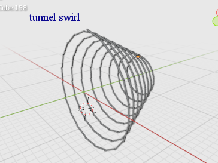

## Blender PY

### sexy triangle maker
corners are cleaner than using the circle maker
```
import bpy
import math
from math import sin, cos, tan, pi, radians

width=3
radius=12 #subtract width if compensation required

Zthick=1

r=radius-width*2

for i in range (0,3):
    xx=radius * sin(((2 * pi) / 3) * i)
    yy=radius * cos(((2 * pi) / 3) * i)
    zz=(i/3)*-360
    ss=(r+2*width)*tan(pi/3)
    bpy.ops.mesh.primitive_cube_add(size=2, location=(xx, yy,0))
    bpy.context.active_object.scale = (ss,width,Zthick)
    bpy.context.active_object.rotation_euler = (0,0,radians(zz))

bpy.ops.mesh.primitive_cube_add(size=2, location=(ss, radius, 0))
bpy.context.active_object.scale = (0.866*width, 0.496*width, Zthick)
bpy.context.active_object.rotation_euler = (0,0,radians(-60))

bpy.ops.mesh.primitive_cube_add(size=2, location=(-ss, radius, 0))
bpy.context.active_object.scale = (0.866*width, 0.496*width, Zthick)
bpy.context.active_object.rotation_euler = (0,0,radians(60))

bpy.ops.mesh.primitive_cube_add(size=2, location=(0, -2*radius ,0))
bpy.context.active_object.scale = (0.866*width, 0.496*width, Zthick)
```


### circle / polygon maker

```
import bpy
import math
from math import sin, cos, tan, pi, radians

width=1
radius=12-width #subtract width if compensation required
n=8
Zthick=1

r=radius-width

for i in range (0,n):
    xx=radius * sin(((2 * pi) / n) * i)
    yy=radius * cos(((2 * pi) / n) * i)
    zz=(i/n)*-360
    ss=(r+2*width)*tan(pi/n)
    bpy.ops.mesh.primitive_cube_add(size=2, location=(xx, yy,0))
    bpy.context.active_object.scale = (ss,width,Zthick)
    bpy.context.active_object.rotation_euler = (0,0,radians(zz)) 
```


### basic circle flat

```
import bpy
import math


radius=12
n=12


for i in range (0,n):
    xx=radius * math.sin(((2 * math.pi) / n) * i)
    yy=radius * math.cos(((2 * math.pi) / n) * i)
    zz=(i/n)*-360
    bpy.ops.mesh.primitive_cube_add(size=2, location=(xx, yy,0))
    bpy.context.active_object.rotation_euler = (0,0,math.radians(zz))
```

    

### basic circle vertical
```
import bpy
import math


radius=12
n=12


for i in range (0,n):
    xx=radius * math.sin(((2 * math.pi) / n) * i)
    zz=radius * math.cos(((2 * math.pi) / n) * i)
    yy=(i/n)*360
    bpy.ops.mesh.primitive_cube_add(size=2, location=(xx, 0,zz))
    bpy.context.active_object.rotation_euler = (0,math.radians(yy),0)
```


### solid polygon / disc maker

```
import bpy
import math


radius=12
n=4	# half of number of sides
Zthick=2


for i in range (0,n):
    zz=(i/n)*-180
    ss=radius*(math.tan(math.pi/(n*2)))
    bpy.ops.mesh.primitive_cube_add(size=2, location=(0,0,0))
    bpy.context.active_object.rotation_euler = (0,0,math.radians(zz))
    bpy.context.active_object.scale = (radius,ss,Zthick)
```


### the orb generator

```
import bpy
import math
from math import radians, tan, pi


radius=10
n=7  #half of number of sides on Y axis (> 2)
rots = 7  # number of times rotated on Z axiz (>2)

rot = 360 / rots / 2
Ythick = radius*tan(pi/(rots*2))


for r in range (0,rots):
    
    for i in range (0,n):
        yy=(i/n)*-180
        ss=radius*(math.tan(math.pi/(n*2)))
        bpy.ops.mesh.primitive_cube_add(size=2, location=(0,0,0))
        bpy.context.active_object.rotation_euler = (0,radians(yy),radians(rot*r))
        bpy.context.active_object.scale = (radius,Ythick,ss)
```


### split into little bits

```
import bpy
import mathutils
import math

#divide by number of cubes
nx = 2
ny = 2
nz = 2
#number of times
#nn = 1

#for srp in range (0,nn):
ob = bpy.context.selected_objects[0]
#orig scale
xo = ob.scale.x
yo = ob.scale.y
zo = ob.scale.z
#orig location
xl = ob.location.x
yl = ob.location.y
zl = ob.location.z

bpy.ops.object.delete(use_global=False, confirm=False)

#new scale
xx = xo / nx
yy = yo / ny
zz = zo / nz
#new location
xln = xl - xo + xx
yln = yl - yo + yy
zln = zl - zo + zz


for i in range (0,nx):
    for ii in range (0,ny):
        for iii in range (0,nz):
            bpy.ops.mesh.primitive_cube_add(size=2, location=(xln+(2*i*xx), yln+(2*ii*yy), (zln+(2*iii*zz))))
            bpy.context.selected_objects[0].scale=(xx,yy,zz)
```


## beta scripts
These are more basic test scripts that are based on the circle script. They don't have things like the auto scaling

###  tornado swirly maker

```
import bpy
import math


radius=40
n=56
rings=4
total=n*rings

rads=radius


for i in range (1,120):
    xx=rads * math.sin(((2 * math.pi) / n) * i*2)
    yy=rads * math.cos(((2 * math.pi) / n) * i*2)
    zz=(i*2/n)*-360
    zzLoc=(i*2/n)*-360
    while zz <= -360:
        zz += 360
    bpy.ops.mesh.primitive_cube_add(size=2, location=(xx, yy,zzLoc/12))
    bpy.context.active_object.rotation_euler = (0,0,math.radians(zz-1))
    bpy.context.active_object.scale = (6-(i*2/total*6.2),1,1)
    rads = (radius -  (i*2/n)*10)
```


### tight ring swirl

```
import bpy
import math


radius=120
n=40
rings=4
total=n*rings

rads=radius

for i in range (1,total):
    xx=rads * math.sin(((2 * math.pi) / n) * i*2)
    yy=rads * math.cos(((2 * math.pi) / n) * i*2)
    zz=(i*2/n)*-360
    bpy.ops.mesh.primitive_cube_add(size=2, location=(xx, yy,0))
    bpy.context.active_object.rotation_euler = (0,0,math.radians(zz-1))
    bpy.context.active_object.scale = (19-(i*2/total*6.2),1,1)
    rads = (radius -  (i*2/n)*10)
```


### tunnel swirly maker

```
import bpy
import math


radius=120
n=40
rings=4
total=n*rings

rads=radius

for i in range (1,total):
    xx=rads * math.sin(((2 * math.pi) / n) * i*2)
    zz=rads * math.cos(((2 * math.pi) / n) * i*2)
    yy=(i*2/n)*360
    while yy >= 360:
        yy -= 360
    bpy.ops.mesh.primitive_cube_add(size=2, location=(xx, 0+i, zz))
    bpy.context.active_object.rotation_euler = (0,math.radians(yy-1),0)
    bpy.context.active_object.scale = (19-(i*2/total*6.2),1,1)
    rads = (radius -  (i*2/n)*10)
```




## Animating

### 5 deg rotate keyframe
For every keyframe in the range, this will rotate the selection around its median on the Z axis, and move 0.25 on Y

```
import bpy
from math import radians

deg = 5
Ymove = 0.25

for i in range (5,35):
    bpy.context.scene.frame_set(i)
    bpy.ops.transform.rotate(value=radians(deg), orient_axis='Z', orient_type='GLOBAL')
    bpy.ops.transform.translate(value=(0, Ymove, 0), orient_axis_ortho='X', orient_type='GLOBAL')
    bpy.ops.anim.keyframe_insert_menu(type='Location')
    bpy.ops.anim.keyframe_insert_menu(type='Rotation')
```


   
### rotate around 3D cursor
this will rotate using the 3D cursor as the origin

```
import bpy
from math import radians

deg = 5

for i in range (5,25):
    bpy.context.scene.frame_set(i)
    bpy.ops.object.origin_set(type='ORIGIN_CURSOR', center='MEDIAN')
    bpy.ops.transform.rotate(value=radians(deg), orient_axis='X', constraint_axis=(True, False, False), orient_type='GLOBAL')
    bpy.ops.object.origin_set(type='ORIGIN_GEOMETRY', center='MEDIAN')
    bpy.ops.anim.keyframe_insert_menu(type='Location')
    bpy.ops.anim.keyframe_insert_menu(type='Rotation')
```

### sort and in/out anim
This will sort all objects per distance from either the 3D cursor, or a vector. Then will create in animation in and/or out to the original position.
(If you only want in or out, the other may be removed. Can use locatioin rotation scale as required)


```
import bpy
import random
from mathutils import Vector
selection = bpy.context.selected_objects


delay = 5               # <-- adjust
duration = 20 + delay    # <-- adjust
startFrame = 10     # <-- adjust

#v = Vector((1, 2, 3))                      # <-- choose enter vector
v = bpy.context.scene.cursor.location       # <-- or use 3D cursor location

selection.sort(key=lambda o:
             (o.matrix_world.to_translation() - v).length)
for ob in selection:
    ob.name = "sortCube"
    ob.data.name = "sortCube"


centerFrame = duration + len(selection) + (startFrame - 1)

bpy.context.scene.frame_set(centerFrame)
bpy.ops.anim.keyframe_insert_menu(type='LocRotScale')
bpy.ops.object.select_all(action='DESELECT')


#in anim
frameZero = centerFrame
for sel in reversed(selection):
    sel.select_set(True)

    bpy.context.scene.frame_set(frameZero - delay)
    bpy.ops.anim.keyframe_insert_menu(type='LocRotScale')
    bpy.context.scene.frame_set(frameZero - duration)

    sel.location.x = 0         # <-- adjust
    sel.location.y = 0         # <-- adjust
    sel.location.z = 10        # <-- adjust
    bpy.ops.anim.keyframe_insert_menu(type='Location')

    #sel.rotation_euler.x =  200      # <-- adjust
    #sel.rotation_euler.y = 10        # <-- adjust
    #sel.rotation_euler.z = -22      # <-- adjust
    #bpy.ops.anim.keyframe_insert_menu(type='Rotation')

    #sel.scale.x = 20      # <-- adjust
    #sel.scale.y = 20      # <-- adjust
    #sel.scale.z = 20      # <-- adjust
    #bpy.ops.anim.keyframe_insert_menu(type='Scaling')

    sel.select_set(False)
    frameZero -= 1


# out anim
frameZero = centerFrame
for sel in selection:
    sel.select_set(True)

    bpy.context.scene.frame_set(frameZero + delay)
    bpy.ops.anim.keyframe_insert_menu(type='LocRotScale')
    bpy.context.scene.frame_set(frameZero + duration)

    sel.location.x = 0      # <-- adjust
    sel.location.y = 0        # <-- adjust
    sel.location.z = -10      # <-- adjust
    bpy.ops.anim.keyframe_insert_menu(type='Location')

    #sel.rotation_euler.x =  200      # <-- adjust
    #sel.rotation_euler.y = 10        # <-- adjust
    #sel.rotation_euler.z = -22      # <-- adjust
    #bpy.ops.anim.keyframe_insert_menu(type='Rotation')

    #sel.scale.x = 2      # <-- adjust
    #sel.scale.y = 2      # <-- adjust
    #sel.scale.z = 2      # <-- adjust
    #bpy.ops.anim.keyframe_insert_menu(type='Scaling')

    sel.select_set(False)
    frameZero += 1

bpy.context.scene.frame_set(centerFrame)
```

