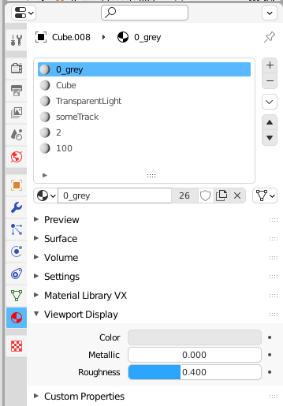

## Blender to Geometry
Blender template/plugin to export geometry with or without animation. 
(blend must be saved at least once, file geometry.json will be in blend path)
(script can either be run in template, or added as plugin)

No after scripting required. Simply copy and paste output into dat file. Geometry data under environment and, if animating, tracks under customEvents.

- v0.01 first release

Materials are used as
1 - color    (only if Standard shader used)
2 - type    (Cube, Cylinder etc)
3 - shader    (Standard, BTSPillar, TransparentLight ...) (template blend should have all possibilities already as materials)
4 - track    (optional, will default to "track")* note, a sequential number will be added to this if animated.
5 - light type    (optional)
6 - light ID    (optional)

End frame needs to be at least 1 above start to enable any animation. 

Fade in/out will appear/disappear the geometry before/after animation/duration.If you have no animations, but want to fading in/out for changing scenes, can simply set start 1 end 2 to enable the function.

Keyframes only will only record at each keyframe between start/end. Otherwise each frame is recorded.

Possible to repeat an animation.

