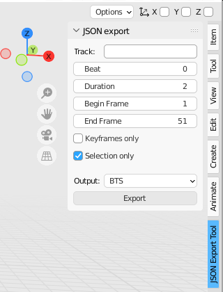

## Blender to JSON
Blender plugin to export animation data direct to JSON. (blend must be saved at least once, file cube.Locations.json will be in blend path)

SW conversion not required, may be imported directly in js script. (an example modified script provided for BTS)

For actual walls, SW is the way to go, as this script is very basic for walls right now.
For environment enhancements, it works quite well.

(note, script may be either pasted into scripting window for session use, or imported)

Keyframes only currently only reads location (so it won't read the keyframe if it's only scale and/or rotation)

