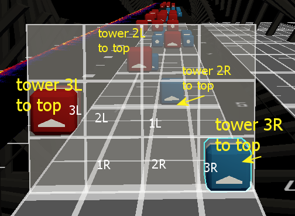

## Tobu - Candyland

This one ended up being created because I wanted to make a script that converts notes to tesla tower movment, instead of trying to use laser speed.

The modelToNote part of the script turns the mapped note into an arrow only, and replaces the body with the model.

The notes to tesla disc movement uses the note layer/index and cut direction to create animateTracks for the tower discs.
Line layer 1 (middle) is for the left towers, 3,2,1,0
Line layer 0 (bottom) is for the right towers, 0,1,2,3

0 is not used/programmed in the script because of the logo. It could be activated the logo was replaced with a tower, and/or movement is desired on the logo's targets.

More custom things could be added for different effects. ie, I used cut dir 5 for the jump effext

