## modified environment scripts
Script is courtesy of swifter https://github.com/Swifter1243/BlenderToEnvironment

Scales have been modified as required for each environment/object used. view his page for full setup information.

KDA, Timbaland, and GreenDay work with using lights.    Billie could work as walls, but there are alignment issues.

### KDA
Is using GlowLine for the lights.    These will light with "Center Lights".

If using chroma, and only individual Center light ID's, NOT "All Lights", the model will not glow, and look more like walls.

(lit with All Lights)
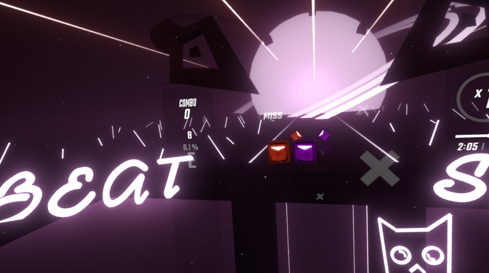

(lit without All Lights)
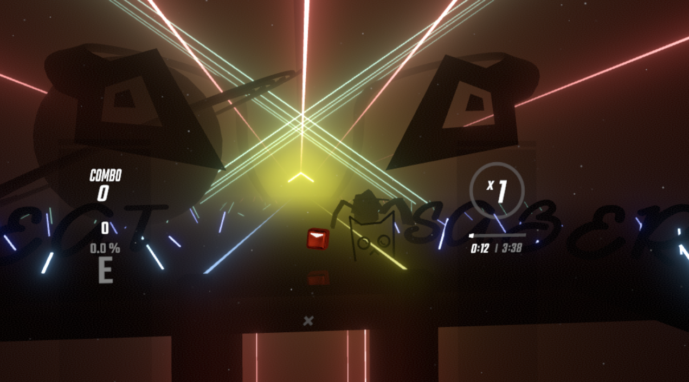
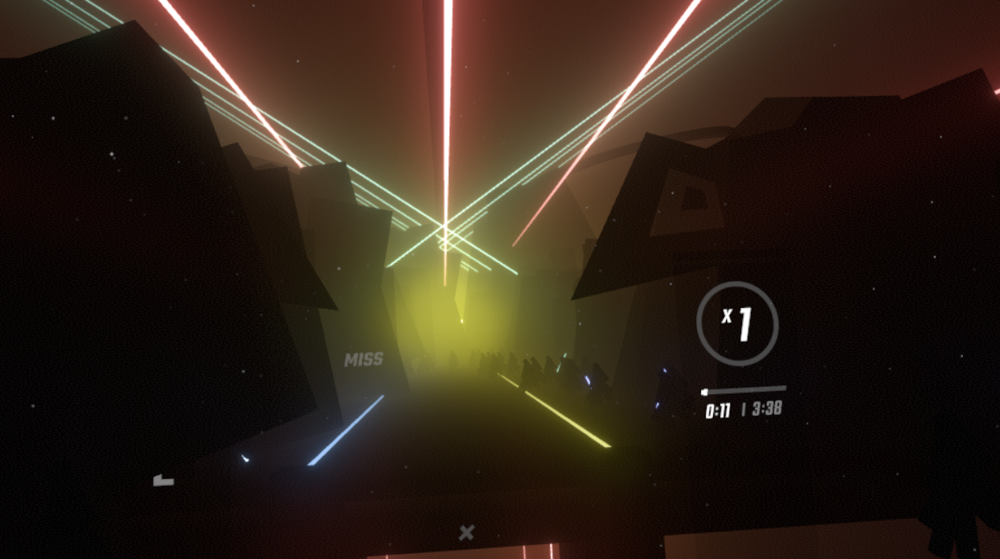

### Timbaland
I have two versions for this one.

1. one is with the GlowLine as in KDA,

2. the second is using LaserL and Laser R.    For this one, the js is setup to use tracks environmentL and environmentR (your SW would be set to these, one model for each side)

(using Glowline)
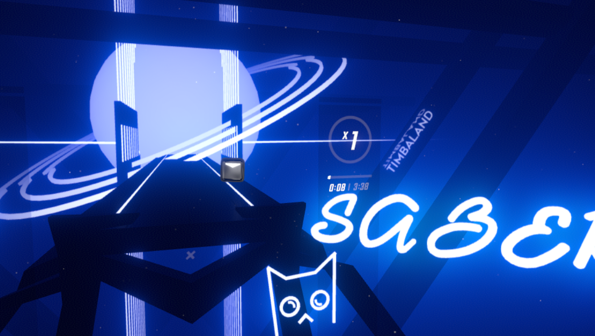

(using Lasers)
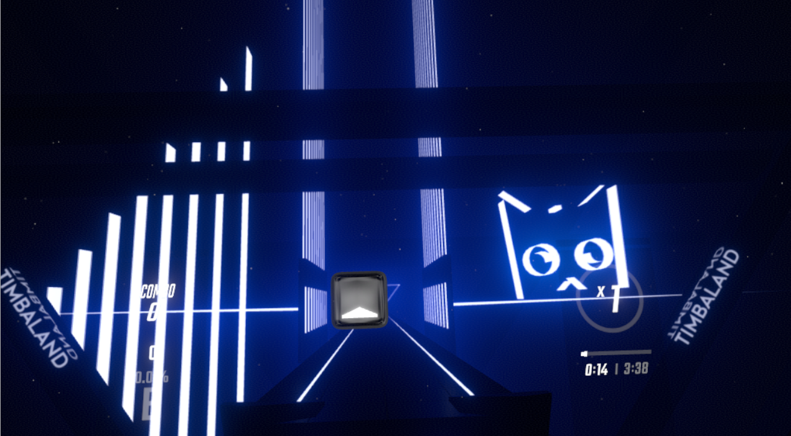
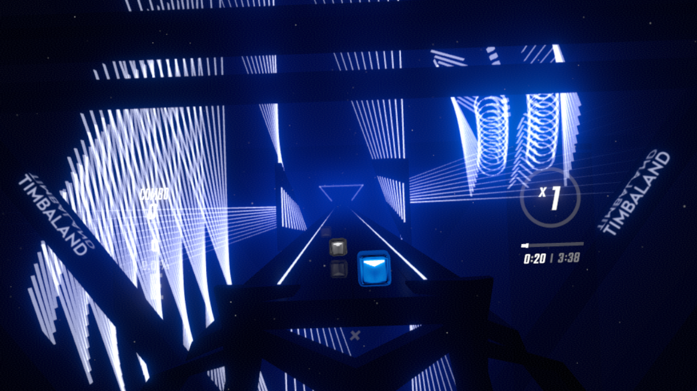

(using GlowLine, unlit)
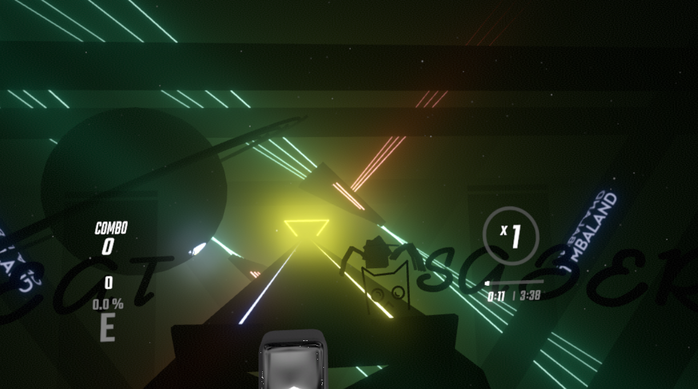

### GreenDay
GD once again uses GlowLine, but has a hollow look to it.

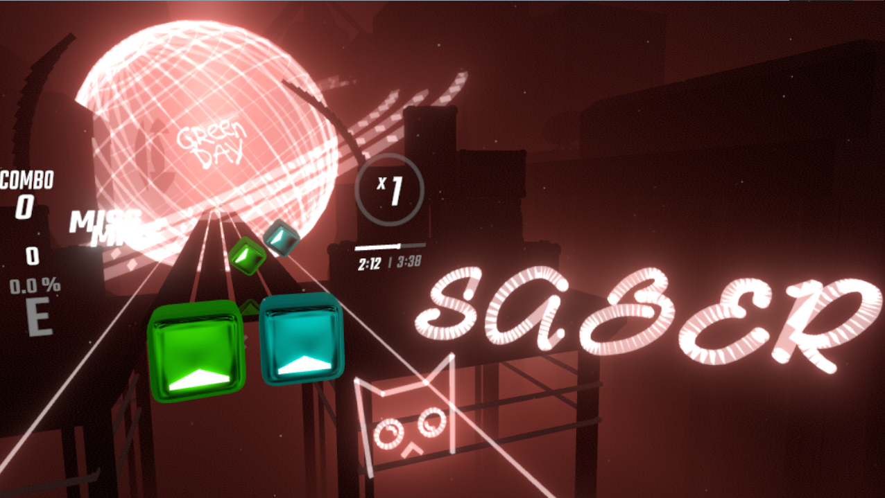

### Billie
Billie has an offset issue, and will require one more step before use.

A blender script has been added to set the object pivots to the right location. This needs to be done just before exporting to a dae file.

You can use _id's LeftFarRail1, or RightFarRail1. They reflect differently depending on which one you use 
(you can also try  LeftFarRail2, or RightFarRail2, and  LeftRail/ RightRail but these last two reflect ugly) 

Testing so far shows that reflecting color depends on the BackLasers color, if using chroma and using individual and not All lights, there should be no reflection.

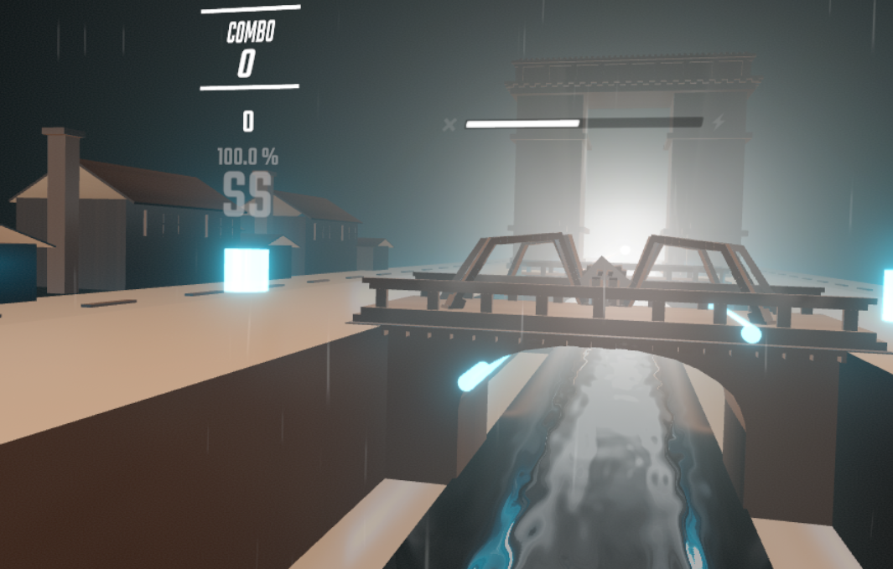

(ALL lights not lit)
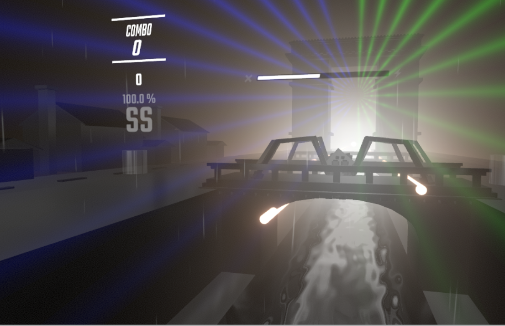

#### blender script
beatsaber.py - install and will be located at the bottom of the Object menu.
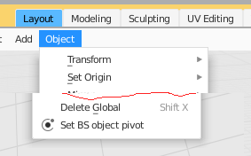
