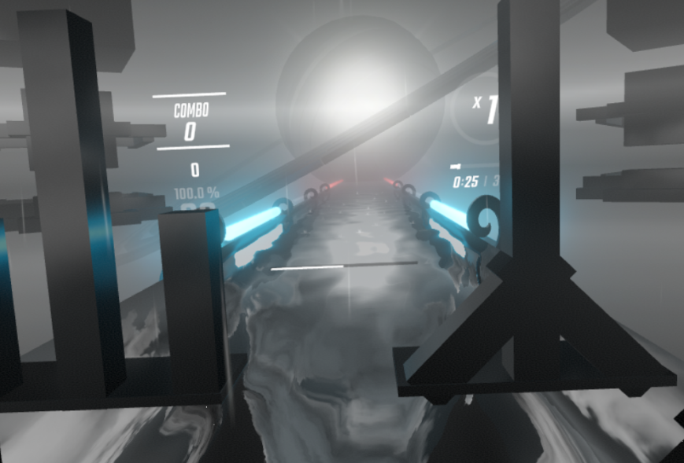
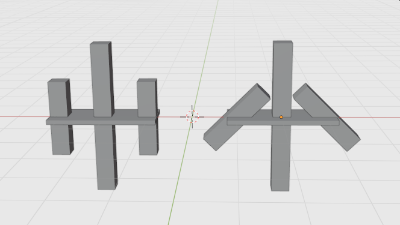

## modified environment scripts
script is courtesy of swifter https://github.com/Swifter1243/BlenderToEnvironment
scales have been modified as required for each environment/object used

KDA, Timbaland, and GreenDay only work as lights (as far as I know)
Billie could work as walls, but there are alignment issues.

### KDA
is using GlowLine for the lights.
these will light with "Center Lights".
if using chroma, and light individual ID's, but NOT "All Lights", the model will not glow, and look more like walls.

### Timbaland
I have two versions for this one.
one is with the GlowLine as in KDA,

the second is using LaserL and Laser R
the js is setup to use track environmentL and environmentR (rather than just environment as for all the others)

### GreenDay
GD once again uses GlowLine, but has a hollow look to it.

### Billie
Billie has problems with offset. Haven't investigated too far (the problem appears to be that the bottom is being used as the center, rather than the center)

you can use _id's LeftFarRail1, or RightFarRail1. They reflect differently depending on which one you use 
(you can also try  LeftFarRail2, or RightFarRail2, and  LeftRail/ RightRail but these last two reflect ugly) 
Testing so far shows that reflecting color depends on the BackLasers color, if using chroma and using individual and not All lights, there should be no reflection.

(the photos show the misalignment between game and blender)

