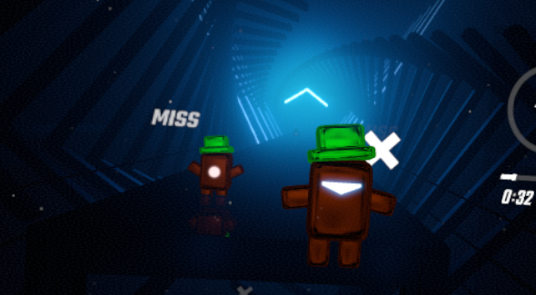
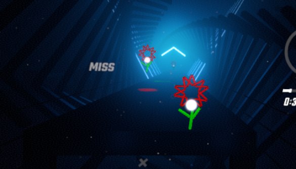
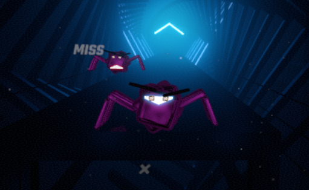
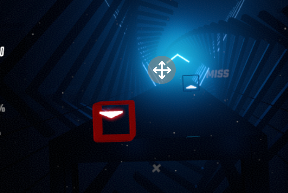

## Model 2 Note

Model must be built centered at zero. A 0.5 scale cube can be placed for approximate reference. Try to stay a little bit back to not block the arrow (or dot).

Right now the script does not rotate the model to match the note direction.

Export .dae same as usual, (apply, forward Z, up Y)

Note animations don't need be past 0.4, as this is just before the player. For simplpicity, set max frames to 100, and don't animate past 40. (Note, animated models can't use the morph function)

Script is set to apply to all notes within range. Can easily be updated to make it track selective.

domo

flower

spider

hollow note
